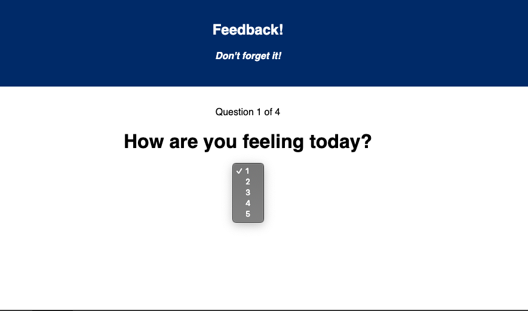

# REDUX FEEDBACK LOOP

## Description

_Duration: 1 day sprint_

This application is designed for a student to provide feedback to the professor on how their studies are going.  The student is asked to rate their feelings on the material, their understanding, and how supported by their instructors they feel on a numeric scale of 1 to 5, and then are allowed to leave any comments they want in an input.  For this application I used react.js and redux as well as routers to navigate between the seperate components.  I used axios to send the feedback information to a database.

## Screen Shots

### Prerequisites

Link to software that is required to install the app (e.g. node).

- [Node.js](https://nodejs.org/en/)
- Axios
- Nodemon
- Express
- React
- Middleware
- Logger
- Redux
- React

## Installation

1. Create a database named `prime_feedback`,
2. The queries in the `tables.sql` file are set up to create all the necessary tables and populate the needed data to allow the application to run correctly. The project is built on [Postgres](https://www.postgresql.org/download/), so you will need to make sure to have that installed. We recommend using Postico to run those queries as that was used to create the queries, 
3. Open up your editor of choice and run an `npm install`
4. Run `npm install redux react-redux` in your terminal
5. Run `npm install redux-logger` in your terminal
6. The `npm install -s react-router-dom` in your terminal
7. Run `npm run server` in your terminal
8. Run `npm run client` in your terminal
9. The `npm run client` command will open up a new browser tab for you!

## Usage
How does someone use this application? Tell a user story here.

1. Follow the instructions on each page.  At the feelings page, select a value from 1 to 5 and click the 'next' button.
2. Provide values for understanding and support.  Note: you must enter an input, the program will send a warning if you forget to do so.
3. When you are done entering your information click submit.  Now your feedback is posted to the database.
4. To provide another round of feedback, simply click the button at the end of the application.

## Built With

- React
- HTML
- CSS
- Javascript
- Express
- Axios
- Nodemon
- Express
- Redux

## Acknowledgement
Thanks to [Prime Digital Academy](www.primeacademy.io) who equipped and helped me to make this application a reality. (Thank you to Mary Mosman and Dev Jana for their counsel.)

## Support
If you have suggestions or issues, please email me at [hoffmann1226@gmail.com]
